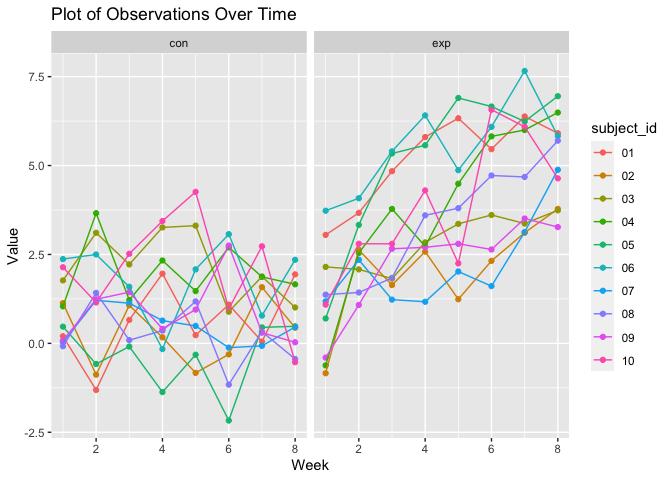
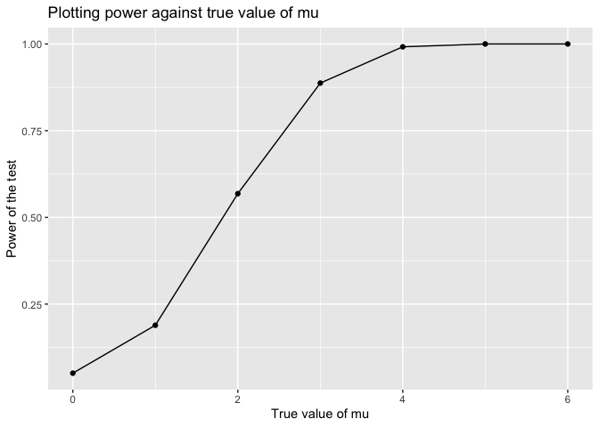

p8105_hw5_nkr2121
================
Nihaal Rahman

*Loading required packages*

``` r
library(dplyr)
library(ggplot2)
library(purrr)
library(readr)
library(stringr)
library(tidyr)
```

**Problem 2**

Using the list.files function to create the initial data frame

``` r
names = list.files("data", full.names = TRUE)

data = map(names, ~read_csv(.x) |> 
             mutate(file_name = .x)) |>
             bind_rows()
```

Now cleaning up the data frame

``` r
data_tidy = data |>
  separate(file_name, into = c("folder", "name"), sep = "/") |> 
  separate(name, into = c("arm", "id"), sep = "_") |> 
  separate(id, into = c("subject_id", "csv"), sep = "\\.") |> 
  select(-folder, -csv) |>
  pivot_longer(col = 1:8, names_to = "week", values_to = "value") |> 
  mutate(week = as.numeric(str_extract(week, "\\d+")))
```

Now creating a spaghetti plot

``` r
figure = ggplot(data_tidy, aes(x = week, y = value, group = subject_id, color = subject_id))+
  geom_point()+
  geom_line()+
  facet_wrap(~arm)+
  labs(title = "Plot of Observations Over Time",
       x = "Week",
       y = "Value")

figure
```

<!-- -->

Looking at the two plots, we can see a distinct difference between the
control and observation group. The control group seems to be relatively
constant across the 8 week period, hovering at roughly 1.25 on average
throughout. However, the experimental group demonstrates an upward trend
as time progresses, ending around an average of 5.0, roughly.

**Question 3**

Starting with mu = 0

``` r
set.seed(1)

sim = function(mu) {
  data = tibble(
    x = rnorm(n = 30, mean = mu, sd = 5),
  )
  output = data |>
    t.test() |>
    broom::tidy() |>
    dplyr::select(estimate, p.value) 
}
```

Now running for mu values, 0-6

``` r
set.seed(1)

results = expand_grid(
  mu = c(0:6),
  iter = 1:5000
) |> 
  mutate(
    estimate = map(mu, sim)
  ) |> 
  unnest(estimate)
```

Plotting proportion of times null was rejected against value of mu

``` r
alpha = 0.05

results |> 
  group_by(mu) |> 
  summarise(proportion = sum(p.value < alpha)/5000) |> 
  ggplot(aes(x = mu, y = proportion)) +
  geom_point() +
  geom_line() +
  labs(
    x = "True value of mu",
    y = "Power of the test",
    title = "Plotting power against true value of mu"
  )
```

<!-- -->

Based on the curve produced, it seems that power increases as the values
of mu increase, however it begins to plateau around 4 at power = 1 (the
maximum value for power). Therefore, as effect size increases, so does
the power.
